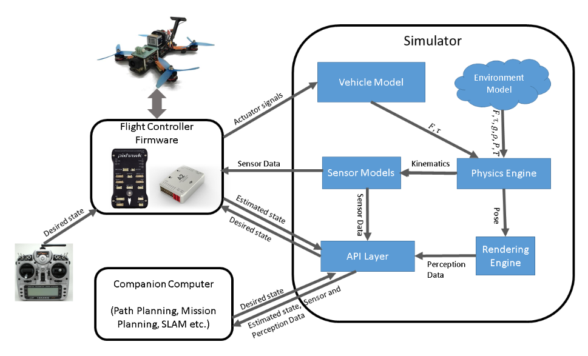

<br>
<p align="center" width="100%">
    
</p>

<p align="center" width="100%">  
  <a alt="Windows Build"
    href="https://github.com/nervosys/AutonomySim/actions/workflows/test_windows.yml">
    
  </a>
  <a alt="Linux Build"
    href="https://github.com/nervosys/AutonomySim/actions/workflows/test_ubuntu.yml">
    
  </a>
  <a alt="macOS Build"
    href="https://github.com/nervosys/AutonomySim/actions/workflows/test_macos.yml">
    
  </a>
</p>

<h1 align="center">The simulation engine for autonomous systems</h1>

## Announcements

* `Unreal Engine` version 5.0 brought powerful new features including [Nanite](https://www.unrealengine.com/en-US/blog/understanding-nanite---unreal-engine-5-s-new-virtualized-geometry-system) and [Lumen](https://www.unrealengine.com/en-US/tech-blog/unreal-engine-5-goes-all-in-on-dynamic-global-illumination-with-lumen), while deprecating support for the [PhysX](https://developer.nvidia.com/physx-sdk) backend.
* `AutonomySim` supports `Unreal Engine` version 5.03 and above. For version 4.27, you can use the `ue4.27` branch.
* The `master` branch supports `Unreal Engine` version 5.3 and below.
* Support for `Unity Engine`, `Gazebo`, and `ROS1` has been deprecated to focus on `Unreal Engine`, `ROS2`, `ArduPilot/PX4`, `qGroundControl`, `PyTorch`, and real-time applications of `AutonomyLib` via software- and hardware-in-the-loop.
* We are researching ways to seemlessly interoperate between `AutonomySim` and `Omniverse/IsaacSim`. The `Omniverse Unreal Engine Connector` makes it possible to sync `Unreal Engine` data with an `Omniverse Nucleus` server, which can then sync with any `Omniverse Connect` application including `IsaacSim`.
* `Windows`: all build scripts have been translated from Command/Batch to PowerShell. `Unreal Engine` still generates Batch files.
* `Linux`: added `ROS2` support for `Ubuntu 22.04 LTS` (Jammy Jellyfish).
* `macOS`: `Unreal Engine` version 5.2 brought native support for the excellent Apple/ARM M-series silicon.

For a complete list of changes, view the [change log](./docs/CHANGELOG.md).

## Vision

> "Physics-based simulation provides an accelerated and safe avenue for developing, verifying, and testing robotic control algorithms and prototype designs. In the quest to leverage machine learning for developing AI-enabled robots, physics-based simulation can generate a wealth of labeled training data in a short amount of time. Physics-based simulation also creates an ideal proving ground for developing intelligent robots that can both learn from their mistakes and be verifiable." [-Liu and Negrut, 2021](https://www.annualreviews.org/doi/full/10.1146/annurev-control-072220-093055)

## Introduction

`AutonomySim` is a high-fidelity, photorealistic simulator for *multi-agent and -domain autonomous systems*, *intelligent robotic systems*, or *embodiment* as it is known in the artificial intelligence (AI) community. `AutonomySim` is built on [`Unreal Engine`](https://www.unrealengine.com/) and based on Microsoft [`AirSim`](https://github.com/microsoft/AirSim/). It is an open-source, cross-platform, modular simulator for AI in robotics that supports software-in-the-loop (SITL) and hardware-in-the-loop (HITL) operational modes for popular flight controllers (e.g., `Pixhawk/PX4`, `APM/ArduPilot`). Future support is planned for ground control software (GCS) including `qGroundControl`. `AutonomySim` is developed as an `Unreal Engine` plugin that can be dropped into any Unreal environment or downloaded from the Epic Marketplace. The goal of `AutonomySim` is to provide physically realistic multi-modal simulations with popular built-in libraries and application programming interfaces (APIs) for the development of new sensing, communication, actuation, and AI systems.

`AutonomySim` provides a foundation for building high-fidelity simulations of a wide variety of autonomous systems. After an extensive analysis of existing solutions, [Nervosys](https://nervosys.ai/) created  `AutonomySim` for its internal product development. We encourage others to use it too! Unlike `AirSim` and other projects based upon it, we intend to make public any and all improvements to the core software framework. We merely ask that you share your improvements in return, although you are not obligated to in any way (`AutonomySim` uses a permissive license that supports commercialization). Together, we can create the ideal open-source simulation platform for intelligent robotic systems.

Join us in developing the most advanced simulator for intelligent robotic systems!

## Supported Operating Systems

Below is a list of officially supported operating systems. We recommend using Windows until Linux support improves.

### Windows

- Windows 10
- Windows 11
- Windows Server 2019 (untested)
- Windows Server 2022 (untested)

### Linux

- Ubuntu 20.04 LTS (Focal Fossa)
- Ubuntu 22.04 LTS (Jammy Jellyfish) - Vulkan incompatibility, Docker recommended
- Ubuntu Server 22.04 LTS (untested)
- Ubuntu Core 22 (untested)
- [Botnix 1.0](https://github.com/nervosys/Botnix/) (in development)

### macOS

> [!NOTE]
> `Unreal Engine` version 5.2 and up provide native support for Apple/ARM M-series silicon

- macOS 11 (Big Sur)
- macOS 12 (Monterey)
- macOS 13 (Ventura)
- macOS 14 (Sonoma)

## Getting Started

Coming soon.

[](https://nervosys.github.io/AutonomySim/apis/)
[](https://nervosys.github.io/AutonomySim/dev_workflow/)

## Documentation

For details on all aspects of `AutonomySim`, view the [documentation](https://nervosys.github.io/AutonomySim/).

For an overview of the simulation architecture, see the below figure.

<p align="center">
  
  <br>
  Overview of the simulation architecuture from <a href="https://arxiv.org/abs/1705.05065">Shah et al. (2017)</a>.
</p>

## Demonstrations

Coming soon.

[](https://youtube.com/)

## Operational Modes

Mirroring real-world robotic systems, `AutonomySim` supports three different operational modes:

1. Human operation
2. Machine operation
3. Hybrid human-machine operation

### Human Operation

If you have wired or remote controller, you can manually control vehicles in the simulator as shown below. For ground vehicles, you can use the arrow keys for control inputs (i.e., steering, accelerating, decelerating). See more details [here](https://nervosys.github.io/AutonomySim/remote_control).

<p align="center">
    
    
</p>

### Machine Operation

`AutonomySim` exposes Application Programming Interfaces (APIs) for progammatic interaction with the simulation vehicles and environment. These APIs can be used to control vehicles and the environment (e.g., weather), generate imagery, audio, or video, record control inputs along with vehicle and environment state, _et cetera_. The APIs are exposed through a remote procedure call (RPC) interface and are accessible through a variety of languages, including C++, Python, C#, and Java.

The APIs are also available as part of a separate, independent, cross-platform library, so that they can be deployed on a real-time embedded system on your vehicle. That way, you can write and test your code in simulation, where mistakes are relatively cheap, before deploying it to real-world systems. Moreover, a core focal area of `AutonomySim` is the development of simulation-to-real (sim2real) domain adaptation AI models, a form of transfer learning. These metamodels map from models of simulations to models of real-world systems, leveraging the universal function approximation abilities of artificial neural networks to _implicitly_ represent real-world processes not _explicitly_ represented in simulations.

Note that you can use [Sim Mode](https://nervosys.github.io/AutonomySim/settings#simmode) setting to specify the default vehicle or the new [Computer Vision](https://nervosys.github.io/AutonomySim/image_apis#computer-vision-mode-1) mode, so you don't get prompted each time you start `AutonomySim`. See [this](https://nervosys.github.io/AutonomySim/apis) for more details.

### Hybrid Human-Machine Operation

Using a form of hardware-in-the-loop (HITL), `AutonomySim` is capable of operating in hybrid human-machine mode. The classical example is a semi-autonomous aircraft stabilization program, which maps human control inputs (or lack thereof) into optimal control outputs.

## Generating Labeled Data for Offline Machine Learning

There are two general approaches to generating labeled data with `AutonomySim`:

1. Using the `record` button manually
2. Using the APIs programmatically

The first method, using the `record` button, is the easiest method. Simply press the big red button in the lower right corner to begin recording. This will record the vehicle pose/state and image for each frame. The data logging code is simple and easy to customize to your application.

<p align="center">
  
  <br>
  Human/manual data recording mode.
</p>

The second method, using the APIs, is a more precise and repeatable method for generating labeled data. The APIs allow you to be in full control of the _how_, _what_, _where_, and _when_ of data logging.

### Computer Vision Mode

It is also possible to use `AutonomySim` with vehicles and physics disabled. This is known as Computer Vision Mode and it supports both human and machine control. In this mode, you can use the keyboard or APIs to position cameras in arbitrary poses and collect imagery including depth, disparity, surface normals, or object segmentation masks. As the name implies, this is useful for generating labeled data for learning computer vision models. See [this](https://nervosys.github.io/AutonomySim/image_apis) for more details.

## Labeled Data Modalities

The following [sensors](https://microsoft.github.io/AirSim/sensors/) and data modalities are either available or planned:

* RGB imagery
* Depth
* Disparity
* Surface normals
* Object panoptic, semantic, and instance segmentation masks
* Object bounding boxes (coming soon)
* Audio (coming soon)
* Video (coming soon)
* Short- or long-wavelength infrared imagery ([see](https://microsoft.github.io/AirSim/InfraredCamera/))
* Multi- and Hyper-spectral (coming soon)
* LiDAR ([see](https://github.com/nervosys/AutonomySim/blob/main/docs/lidar.md); GPU acceleration coming soon)
* RaDAR (coming soon)
* SoNAR (coming soon)

Autolabeling systems may be added in the future.

## Vehicles

### Ground

* Automobile
* BoxCar (coming soon)
* ClearPath Husky (coming soon)
* Pioneer P3DX (coming soon)

### Air

* Quadcopter

## Machine Learning Applications

### Learning Perception, Communication, Planning, and Control Models

Coming soon.

### Imitation or Apprenticeship Learning

Coming soon. An example of recording control inputs and vehicle state for learning control systems.

### Neural Radiance Fields

Coming soon. Learning compressed 3-D radiative transfer models.

### Large Language Models

Coming soon. An example of using a large language model (LLM) to parse text commands into planning and control inputs for robotic systems. See [Eureka](https://eureka-research.github.io/).

### Learning Surrogate Models or Emulators

Coming soon.

### Learning World Models

Coming soon.

## Other Applications

### Sensor System Development

Coming soon.

### Locomotion System Development

Coming soon. An example of learning structure, actuator, and locomotion models. This is useful, for example, for developing robotic systems that are robust to major structural failures, such as the loss of motors or legs.

### Communication System Development

Coming soon.

### Simulating Specific or General Environments

Coming soon.

## Environmental Dynamics

### Weather

The weather system support human and machine control. Press the `F10` key to see the available weather effect options. You can also control the weather using the APIs, as shown [here](https://nervosys.github.io/AutonomySim/apis#weather-apis).

<p align="center">
  
  <br>
  Weather effects menu.
</p>

Press the `F1` key to see other available options.

### Procedural Terrain Generation

Coming soon.

## Tutorials

### Videos

- [Setting up AirSim with Pixhawk Tutorial](https://youtu.be/1oY8Qu5maQQ) by Chris Lovett
- [Using AirSim with Pixhawk Tutorial](https://youtu.be/HNWdYrtw3f0) by Chris Lovett
- [Using off-the-self environments with AirSim](https://www.youtube.com/watch?v=y09VbdQWvQY) by Jim Piavis
- [Harnessing high-fidelity simulation for autonomous systems](https://note.microsoft.com/MSR-Webinar-AirSim-Registration-On-Demand.html) by Sai Vemprala

### Guides

- [Reinforcement Learning with AirSim](https://nervosys.github.io/AutonomySim/reinforcement_learning) by Ashish Kapoor

### Projects

- [The Autonomous Driving Cookbook](https://github.com/nervosys/AutonomySim-DrivingCookbook) by Microsoft Deep Learning and Robotics Garage Chapter
- [Using TensorFlow for simple collision avoidance](https://github.com/nervosys/AutonomySim-TensorFlow) by Simon Levy and WLU team

## Join the Community

For updates or answers to your questions, join our GitHub Discussion group [here](https://github.com/nervosys/AutonomySim/discussions) or our Discord channel [here](https://discord.gg/Mu97ucWa). 

For information on becoming a contributor, see the following section.

## Contributing

Community contributions are *strongly encouraged* via GitHub Issues and Pull Requests. If you are looking for areas to contribute, please take a look at the [open issues](https://github.com/nervosys/AutonomySim/issues). For more information about contributing to the project, please visit the [contributing page](https://github.com/nervosys/AutonomySim/blob/master/CONTRIBUTING.md).

Our [GitHub Insights](https://github.com/nervosys/AutonomySim/pulse/) page provides a sense of the project activity.

### Project Structure

The `AutonomySim` repository consists of multiple projects with a project, the core of which is `AutonomyLib`. Additional projects include `DroneServer`, `DroneShell`, `HelloCar`, `HelloDrone`, `MavLinkCom`, `Examples`, and `LogViewer`.

It provides wrappers for `Unreal Engine`, `Python`, and `ROS2`, as well as build scripts for `Docker` and `Azure`.

The build system uses `Visual Studio 2022` for Windows and `CMake` for cross-platform support. Pre-build scripts are run beforehand to prepare the target project for compilation.

For more information, see the following pages:

* [Project Design](https://nervosys.github.io/AutonomySim/design)
* [Code Structure](https://nervosys.github.io/AutonomySim/code_structure)
* [Contribution Guidelines](CONTRIBUTING.md)

## Current and Past Users

A subset of the organizations, people, and projects that have used `AutonomySim` or its predecessor, `AirSim`, are listed [here](https://nervosys.github.io/AutonomySim/who_is_using).

If you would like to be featured on this list, please submit a request [here](https://github.com/nervosys/AutonomySim/issues).

## Roadmap

- [x] Focus on Unreal Engine, deprecate support for ROS1, Unity, Gazebo
- [x] Project reorganization and modernization (restructuring, renaming, refactoring, porting, updating)
  - [x] Add support for the latest `Unreal Engine` version 5.3
  - [ ] Add API, RPC support for Rust, deprecate support for Java and C#
  - [ ] Update automated tests
- [ ] Add libraries and tools for artificial intelligence (AI)
  - [ ] CUDA Toolkit, CuDNN, TensorRT
  - [ ] Python, Mojo, PyTorch, JAX, Flax, MLX, OpenCV
  - [ ] Generative models: LLaMA 2, Mistral/Mixtral, OpenHermes, SD, LLaVA
  - [ ] Robotics foundation models
  - [ ] Multi-modal models
  - [ ] Interpretability, explainability, and hard bounds or guardrails
  - [ ] Safety and cybersecurity
- [ ] Add headless server mode for control via external program, container, virtual machine, or local network
  - [ ] Add NVIDIA JetPack and Botnix OS support for software-in-the-loop (SITL)
- [ ] Add the JSBSim flight dynamics model (FDM) plugin for Unreal Engine per [Project Antoinette](https://www.unrealengine.com/en-US/blog/antoinette-project-tools-to-create-the-next-generation-of-flight-simulators/)
- [ ] Add flight control software (FCS): BetaFlight, OpenPilot, LibrePilot, dRehmFlight, Flightmare/flightlib
- [ ] Add MavLink-based ground control software (GCS): qGroundControl, Mission Planner, Auterion Mission Control
- [ ] Add self-driving car (i.e., rover) software: openpilot, Autoware, CARLA, Vista, Aslan, OpenPodcar/ROS
- [ ] Add NVIDIA Omniverse IsaacSim/Gym interoperability

## Sponsors

* [Nervosys](https://nervosys.ai/): *"Accelerating the development of robotic general intelligence"*

## Donations

`AutonomySim` is made possible by [Nervosys](https://nervosys.ai/), NVIDIA, Epic Games, Microsoft, the
Linux Foundation and countless contributors to related projects.

We need your support to ensure the success of `AutonomySim` development. Reach out to us at opensource@nervosys.ai to learn how you can support this project.

## Background

`AutonomySim` began as an update to the open-source `AirSim` project, which Microsoft
shutdown in July of 2022 to focus on their closed-source cloud software-as-a-service (SaaS)
version. Our first task was to update `AirSim` to support `Unreal Engine` 5, which we soon
discovered was in already in development at other organizations. Unfortunately, these
organizations only seemed to be interested in creating closed-source cloud SaaS platforms
similar to Microsoft, which had resulted in the `AirSim` project being archived. Fearing a repeat of this outcome, we wanted to take the project in a new, open, multi-agent, -domain, and -modal direction. We are not very interested in cloud platforms, which are simply other peoples' computers,
but rather on running `AutonomySim` in our own secure enclaves. It is, after all, a game engine. We want to see it in all its glory and think you will too.

While `Unreal Engine` is well-suited to simulating the terrestrial domain due to its classical Newtonian physics engine, the aerial domain is better represented by dedicated flight dynamics models (FDMs). These small models approximate much larger computational fluid dynamics (CFD) models that are too expensive to run in real-time. Thus, it makes little sense to limit `AutonomySim` to the aerial domain and individual agents, given that multi-agent, -domain, and -modal simulation capabilities are needed to operate in complex real-world systems. We hope that we, as a community, can bring the marine and aerial domains to parity with dedicated simulators.

Are you a fluid dynamics expert? We would love to have your input.

### Comparison with Related Projects

Below is a comparison with `AirSim` and its other forks.

| Project                                                 | Origin   | Year | Core Software | Server Software | Cloud SaaS                                                                              | Organization                     |
| ------------------------------------------------------- | -------- | ---- | ------------- | --------------- | --------------------------------------------------------------------------------------- | -------------------------------- |
| [AirSim](https://github.com/microsoft/AirSim/)          | original | 2017 | open-source   | closed-source   | [Project AirSim](https://www.microsoft.com/en-us/ai/autonomous-systems-project-airsim/) | [Microsoft](#)                   |
| [Cosys-AirSim](https://cosys-lab.github.io/)            | fork     | 2020 | open-source   | none            | none                                                                                    | [Cosys Lab](#)                   |
| [Colosseum](https://github.com/CodexLabsLLC/Colosseum/) | fork     | 2022 | open-source   | closed-source   | [SWARM](https://www.swarmsim.io/)                                                       | [Codex Labs](#)                  |
| [AirGen](#)                                             | fork     | 2023 | closed-source | closed-source   | [GRID](https://github.com/ScaledFoundations/GRID-playground/)                           | [Scaled Foundations](#)          |
| [AutonomySim](#)                                        | fork     | 2023 | open-source   | open-source     | none                                                                                    | [Nervosys](https://nervosys.ai/) |

Compared to other simulation engines for robotic systems, `AutonomySim` is open-source and built on top of a state-of-the-art game engine with the best available features and performance. It also has batteries-included support for popular machine learning workflows.

`AutonomySim` has been designed from the ground-up for robotic general intelligence (RGI) or general robotic intelligence (GRI) based on multi-modal, high-dimensional sensing combined with state-of-the-art AI modeling techniques, terms and concepts that Nervosys rightfully [invented](https://blog.nervosys.ai/interview-at-icra/).

## References

For technical aspects on the design of `AutonomySim`, refer to the original `AirSim` manuscripts and subsequent works:

```bibtex
@inproceedings{shah2018,
  author = {Shah, Shital and Dey, Debadeepta and Lovett, Chris and Kapoor, Ashish},
  year = 2018,
  title = {{AirSim}: High-Fidelity Visual and Physical Simulation for Autonomous Vehicles},
  booktitle = {Field and Service Robotics},
  editor = {Hutter, Marco and Siegwart, Roland},
  pages = {621--635},
  isbn= {978-3-319-67361-5},
  doi = {10.1007/978-3-319-67361-5_40}
  publisher = {Springer International Publishing},
  address = {Cham, Switzerland},
  url = {https://doi.org/10.1007/978-3-319-67361-5_40},
  note = {AirSim}
}

@inproceedings{bondi2018,
  author = {Bondi, Elizabeth and Dey, Debadeepta and Kapoor, Ashish and Piavis, Jim and Shah, Shital and Fang, Fei and Dilkina, Bistra and Hannaford, Robert and Iyer, Arvind and Joppa, Lucas and Tambe, Milind},
  year = 2018,
  title = {{AirSim-W}: A Simulation Environment for Wildlife Conservation with {UAVs}},
  booktitle = {Proceedings of the 1st ACM SIGCAS Conference on Computing and Sustainable Societies},
  series = {COMPASS '18},
  number = 40,
  isbn = {9781450358163},
  doi = {10.1145/3209811.3209880},
  organization = {ACM},
  publisher = {Association for Computing Machinery},
  address = {Menlo Park and San Jose, CA, USA},
  url = {https://doi.org/10.1145/3209811.3209880},
  note = {AirSim}
}

@article{schouten2021,
  author = {Schouten, Girmi and Jansen, Wouter and Steckel, Jan},
  year = 2021,
  title = {Simulation of Pulse-Echo Radar for Vehicle Control and {SLAM}},
  journal = {Sensors},
  volume = 21,
  number = 2,
  doi = {10.3390/s21020523},
  url = {https://www.mdpi.com/1424-8220/21/2/523},
  note = {Cosys-AirSim}
}

@inproceedings{jansen2022,
  author = {Jansen, Wouter and Huebel, Nico and Steckel, Jan},
  year = 2022,
  title = {Physical {LiDAR} Simulation in Real-Time Engine},
  booktitle = {2022 IEEE Sensors},
  volume = {},
  number = {},
  pages = {1--4},
  doi = {10.1109/SENSORS52175.2022.9967197},
  url = {https://ieeexplore.ieee.org/document/9967197},
  eprint = {https://arxiv.org/abs/2208.10295},
  note = {Cosys-AirSim}
}

@inproceedings{jansen2023,
  author = {Jansen, Wouter and Verreycken, Erik and Schenck, Anthony and Blanquart, Jean-Edouard and Verhulst, Connor and Huebel, Nico and Steckel, Jan},
  year = 2023,
  title = {{Cosys-AirSim}: A Real-Time Simulation Framework Expanded for Complex Industrial Applications},
  booktitle = {2023 Annual Modeling and Simulation Conference (ANNSIM)},
  month = 05,
  volume = {},
  pages = {37--48},
  issn = {},
  publisher = {IEEE Computer Society},
  address = {Los Alamitos, CA, USA},
  doi = {},
  url = {https://www.computer.org/csdl/proceedings-article/annsim/2023/10155352/},
  eprint = {https://arxiv.org/abs/2303.13381},
  note = {Cosys-AirSim}
}
```

A manuscript on the design and implementation of `AutonomySim` is forthcoming.

## Frequently Asked Questions (FAQ)

For other questions, see the [FAQ](https://nervosys.github.io/AutonomySim/faq) and feel free to post issues in the repository [here](https://github.com/nervosys/AutonomySim/issues).

## Code of Conduct

The AutonomySim [Code of Conduct](CODE_OF_CONDUCT.md) is based on the _Contributor Covenant version 2.1_, itself inspired by the Mozilla standards. The original unmodified covenant can be found [here](https://www.contributor-covenant.org/version/2/1/code_of_conduct.html). The changes made better reflect the core value of our organization in preserving freedom.

For answers to common questions about this code of conduct, see the [FAQ](https://www.contributor-covenant.org/faq). Translations are available [here](https://www.contributor-covenant.org/translations).

Contact us through [GitHub Discussions](https://github.com/nervosys/AutonomySim/discussions) with any additional questions or comments, so that we may maintain transparency in adopting community guidelines.

## License

This project is released under the [Apache 2.0 License](LICENSE), a permissible license often preferred for commercial use.

Any and all sublicenses can be found [here](sublicenses/).

<p align="center">
  <br>
  
  <br>
  TM 2024 &copy; Nervosys, LLC
</p>
